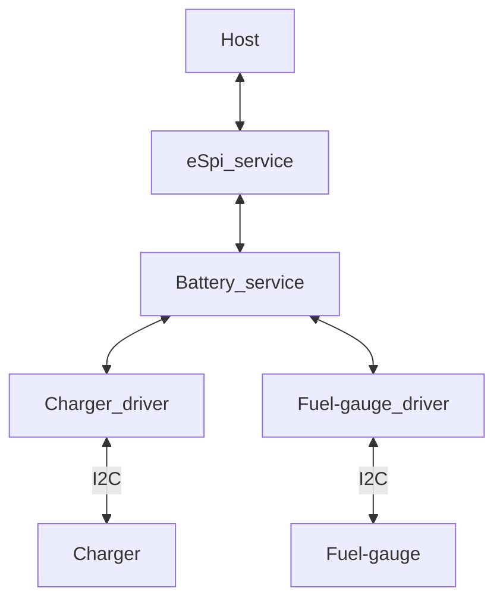
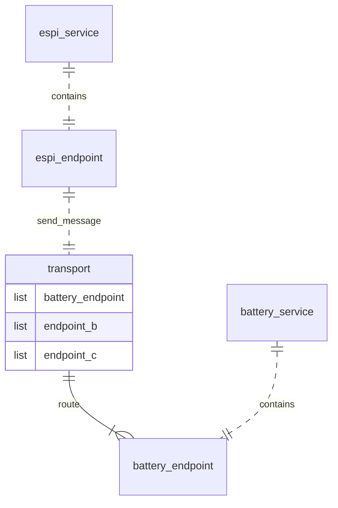
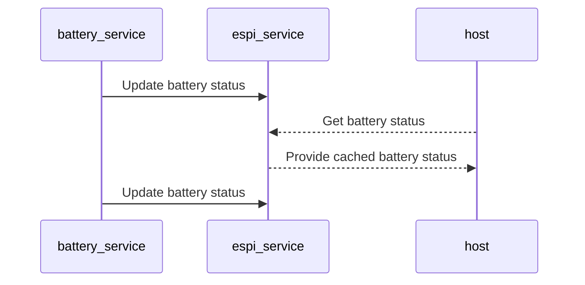
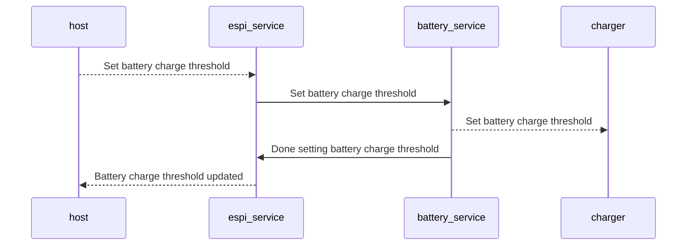

## High Level Overview

## Transport (IPC)

Protocol agnostic transport allowing dynamic number of endpoints to send and receive message. It makes use of the instrusive list to allow dynamic number of endpoints corresponding to each endpoint ID.

## Sequence 

##### read operation

- Battery-service registers with the espi-service for an entry in the transport table
- Battery-service periodically broadcasts updates from their table entries by sending a message throught transport to espi-service
- Host sends ACPI message, arrives at espi-service, espi service gets its cached battery value

##### write operation

- Battery-service registers with the espi-service for an entry in the transport table
- Host wants to update (write) to battery charge threshold, espi_service forwards that message along to battery service using transport
- Battery-service performs the bus operation to update the charge threshold on the charge
- After bus operation is done, battery-service notifies espi-service
- espi-service updates the memory table and **optionally** can notify the host

## Planned ACPI control methods support
[Method documentation here.](https://uefi.org/htmlspecs/ACPI_Spec_6_4_html/10_Power_Source_and_Power_Meter_Devices/Power_Source_and_Power_Meter_Devices.html)

| Command           | Description                                                                                                 |
|-------------------|-------------------------------------------------------------------------------------------------------------|
| EC_BAT_GET_BIX = 0x1 | Returns information about battery, model, serial number voltage. Note this is a superset of BIF. (MPTF)   |
| EC_BAT_GET_BST = 0x2 | Get Battery Status, must also have notify event on state change. (MPTF)                                  |
| EC_BAT_GET_PSR = 0x3 | Returns whether this power source device is currently online. (MPTF)                                     |
| EC_BAT_GET_PIF = 0x4 | Returns static information about a power source. (MPTF)                                                  |
| EC_BAT_GET_BPS = 0x5 | Power delivery capabilities of battery at present time. (MPTF)                                           |
| EC_BAT_SET_BTP = 0x6 | Set battery trip point to generate SCI event (MPTF)                                                      |
| EC_BAT_SET_BPT = 0x7 | Set Battery Power Threshold (MPTF)                                                                       |
| EC_BAT_GET_BPC = 0x8 | Returns static variables that are associated with system power characteristics on the battery path and power threshold support settings. (MPTF) |
| EC_BAT_SET_BMC= 0x9  | Battery Maintenance Control                                                                              |
| EC_BAT_GET_BMD = 0xA  | Returns battery information regarding charging and calibration                                           |
| EC_BAT_GET_BCT = 0xB  | Returns battery charge time.                                                                             |
| EC_BAT_GET_BTM = 0xC  | Get estimated runtime of battery while discharging                                                       |
| EC_BAT_SET_BMS = 0xD  | Sets battery capacity sampling time in ms                                                                |
| EC_BAT_SET_BMA = 0xE  | Battery Measurement Average Interval                                                                     |

### ACPI messages
| Description                | Size_Bits | Source       |
|----------------------------|-----------|--------------|
| BAT_LAST_FULL_CHARGE       | 32        | BIX          |
| BAT_CYCLE_COUNT            | 32        | BIX          |
| BAT_STATE                  | 32        | BST          |
| BAT_PRESENT_RATE           | 32        | BST          |
| BAT_REMAIN_CAP             | 32        | BST          |
| BAT_PRESENT_VOLT           | 32        | BST          |
| BAT_PSR_STATE              | 32        | PSR/PIF      |
| BAT_PSR_MAX_OUT            | 32        | PIF          |
| BAT_PSR_MAX_IN             | 32        | PIF          |
| BAT_PEAK_LEVEL             | 32        | BPS          |
| BAT_PEAK_POWER             | 32        | BPS/BPC      |
| BAT_SUS_LEVEL              | 32        | BPS          |
| BAT_SUS_POWER              | 32        | BPS/PBC      |
| BAT_PEAK_THRES             | 32        | BPT          |
| BAT_SUS_THRES              | 32        | BPT          |
| BAT_TRIP_THRES             | 32        | BTP          |
| BAT_BMC_DATA               | 32        | BMC          |
| BAT_BMD_STATUS             | 32        | BMD          |
| BAT_BMD_FLAGS              | 32        | BMD          |
| BAT_BMD_COUNT              | 32        | BMD          |
| BAT_CHARGE_TIME            | 32        | BCT          |
| BAT_RUN_TIME               | 32        | BTM          |
| BAT_SAMPLE_TIME            | 32        | BMS/BMA      |

### MPTF messages
| Description         | Size_Bits | Source                  |
|---------------------|-----------|-------------------------|
| THM_TMP1_VAL        | 32        | TMP                     |
| THM_TMP1_TIMEOUT    | 32        | EC_THM_SET/GET_THRS     |
| THM_TMP1_LOW        | 32        | EC_THM_SET/GET_THRS     |
| THM_TMP1_HIGH       | 32        | EC_THM_SET/GET_THRS     |
| THM_COOL_MODE       | 32        | EC_THM_SET_SCP          |
| THM_FAN_ON_TEMP     | 32        | GET/SET VAR             |
| THM_FAN_RAMP_TEMP   | 32        | GET/SET VAR             |
| THM_FAN_MAX_TEMP    | 32        | GET/SET VAR             |
| THM_FAN_CRT_TEMP    | 32        | GET/SET VAR             |
| THM_FAN_HOT_TEMP    | 32        | GET/SET VAR PROCHOT notification |
| THM_FAN_MAX_RPM     | 32        | GET/SET VAR             |
| THM_FAN_RPM         | 32        | GET VAR                 |
| THM_DBA_LIMIT       | 32        | GET/SET VAR             |
| THM_SON_LIMIT       | 32        | GET/SET VAR             |
| THM_MA_LIMIT        | 32        | GET/SET VAR             |

