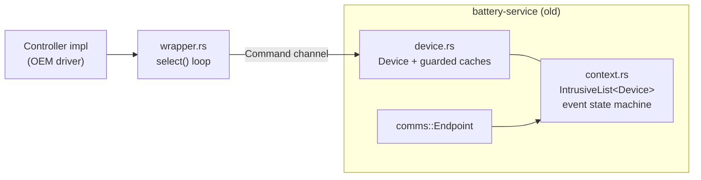
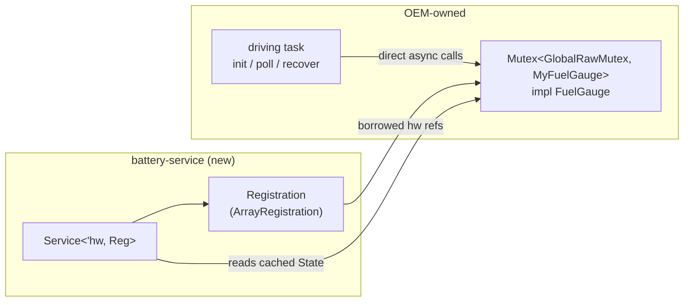
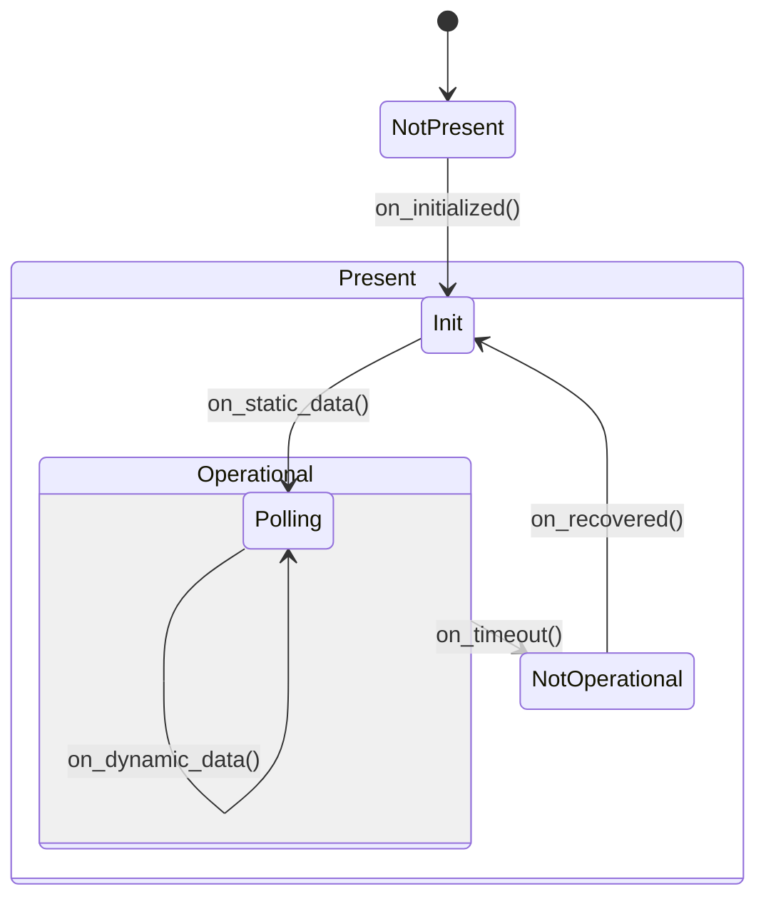
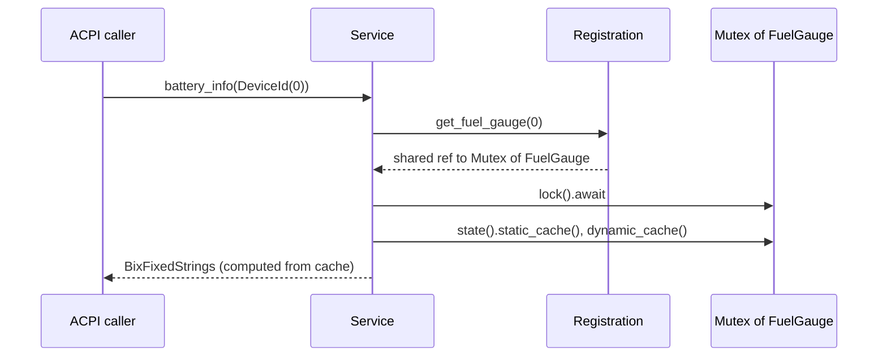
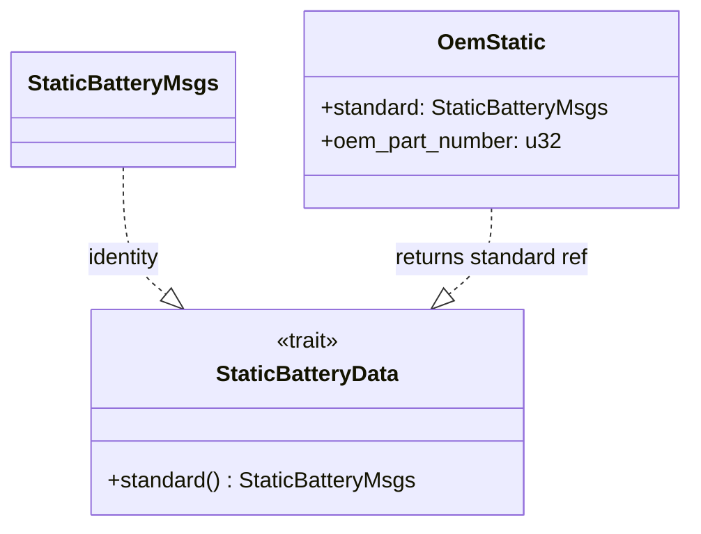
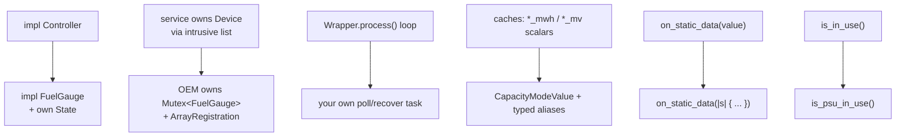

# Battery Service Redesign — PRs #893 and #895

In-depth design documentation and an uptake (migration) plan for the two
breaking-change pull requests that together redesign the battery service:

| PR | Title | Theme | Depends on |
|----|-------|-------|------------|
| [#893](https://github.com/OpenDevicePartnership/embedded-services/pull/893) | Refactor battery service to use a new fuel gauge registration system and move away from intrusive list and static lifetimes | **Ownership & wiring** | — |
| [#895](https://github.com/OpenDevicePartnership/embedded-services/pull/895) | Make battery data caches OEM extensible | **Data model** | #893 |

Both PRs are labeled `BREAKING CHANGE`. #895 is stacked on top of #893, so the
two land together from an integrator's perspective. This document treats them as
a single migration but documents each PR's contribution separately so reviewers
can reason about them independently.

> Scope note: this describes the state of the `battery-service` and
> `battery-service-interface` crates on the `battery-oem-extensible-cache`
> branch (which contains both PRs). Line references point at the post-merge
> files.

---

## Table of contents

- [Reading guide](#reading-guide)
- [Part 1 — PR #893: Fuel gauge registration system](#part-1--pr-893-fuel-gauge-registration-system)
  - [Motivation](#motivation)
  - [The old architecture (removed)](#the-old-architecture-removed)
  - [The new architecture](#the-new-architecture)
  - [Key types and APIs](#key-types-and-apis)
  - [The fuel gauge state machine](#the-fuel-gauge-state-machine)
  - [How a query is answered](#how-a-query-is-answered)
  - [File-by-file change summary](#file-by-file-change-summary-893)
  - [Breaking changes (#893)](#breaking-changes-893)
- [Part 2 — PR #895: OEM-extensible battery data caches](#part-2--pr-895-oem-extensible-battery-data-caches)
  - [Motivation](#motivation-1)
  - [Generic `State<S, D>` and the data-access traits](#generic-states-d-and-the-data-access-traits)
  - [Self-describing capacity/rate units](#self-describing-capacityrate-units)
  - [Unit-aware field types](#unit-aware-field-types)
  - [New ACPI/SBS fields](#new-acpisbs-fields)
  - [Manual `Default` implementations](#manual-default-implementations)
  - [Closure-based cache updates](#closure-based-cache-updates)
  - [Generic `compute_*` helpers](#generic-compute_-helpers)
  - [Realistic mock data](#realistic-mock-data)
  - [Writing an OEM-extended cache](#writing-an-oem-extended-cache)
  - [Breaking changes (#895)](#breaking-changes-895)
- [Part 3 — Uptake / migration plan](#part-3--uptake--migration-plan)
  - [Audience and prerequisites](#audience-and-prerequisites)
  - [Migration at a glance](#migration-at-a-glance)
  - [Step-by-step migration](#step-by-step-migration)
  - [Validation checklist](#validation-checklist)
  - [Rollout sequencing and risk](#rollout-sequencing-and-risk)
- [Appendix A — Static cache field migration](#appendix-a--static-cache-field-migration)
- [Appendix B — Dynamic cache field migration](#appendix-b--dynamic-cache-field-migration)
- [Appendix C — API rename cheat sheet](#appendix-c--api-rename-cheat-sheet)
- [Appendix D — Gotchas](#appendix-d--gotchas)

---

## Reading guide

- **Integrators** wiring the battery service into an EC should read
  [Part 1](#part-1--pr-893-fuel-gauge-registration-system) and
  [Part 3](#part-3--uptake--migration-plan).
- **Fuel-gauge driver authors** should read all three parts; the data model in
  [Part 2](#part-2--pr-895-oem-extensible-battery-data-caches) determines what
  your `update_static_data` / `update_dynamic_data` implementations write.
- **OEMs needing custom cached telemetry** should focus on
  [Writing an OEM-extended cache](#writing-an-oem-extended-cache).

---

## Part 1 — PR #893: Fuel gauge registration system

### Motivation

The previous battery service hard-coded a lot of policy and infrastructure:

- It owned an **intrusive linked list** of `Device` nodes and ran an internal
  **event-driven state machine** (`context.rs`) over an `embassy_sync` channel.
- Each fuel gauge had to be bound to the service via a `Wrapper` that ran its own
  `select`-based message loop (`wrapper.rs`) and a `Controller` trait
  (`controller.rs`).
- The service was reached through a `comms::Endpoint` and assumed `'static`
  lifetimes throughout, which made it hard to unit-test and impossible to
  instantiate more than once.
- The cached battery data lived behind guarded accessors
  (`get_static_battery_cache_guarded`, …) owned by the service rather than by the
  driver.

This conflicts with the workspace
[API guidelines](./api-guidelines.md): no `'static` singletons, caller-allocated
state, and trait-based interfaces. PR #893 rebuilds the service around those
principles.

### The old architecture (removed)



The following files were **deleted** by #893:

| File | Lines | What it did |
|------|------:|-------------|
| `battery-service/src/context.rs` | 517 | Intrusive-list registry + `BatteryEvent` state machine driven over a channel. |
| `battery-service/src/device.rs` | 266 | `Device` node (intrusive list `Node`/`NodeContainer`), guarded `StaticBatteryMsgs`/`DynamicBatteryMsgs` caches. |
| `battery-service/src/controller.rs` | 26 | `Controller` trait (`get_static_data`/`get_dynamic_data` **by value**, `get_device_event`, timeouts). |
| `battery-service/src/wrapper.rs` | 103 | `Wrapper` binding a `Controller` to a `Device`, running a `select` loop over hardware events and context commands. |

Dependencies `embassy-futures`, `embassy-sync`, and `odp-service-common` were
dropped from `battery-service/Cargo.toml` as a result.

### The new architecture



Key inversions of control:

1. **The OEM owns the fuel gauge.** It is a plain value (typically wrapped in an
   `embassy_sync::mutex::Mutex<GlobalRawMutex, _>`) allocated by the integrator,
   not a `'static` singleton inside the service.
2. **The OEM drives the fuel gauge directly.** There is no internal command
   channel or `Wrapper` loop. The integrator calls `initialize()`,
   `update_static_data()`, `update_dynamic_data()`, and `ping()` from its own
   task and decides the polling cadence and recovery policy.
3. **The service only reads cached state.** `Service<'hw, Reg>` holds a
   `Registration` of `&'hw` fuel-gauge references and answers ACPI queries by
   locking a fuel gauge and reading its cached `State`.
4. **No `'static` requirement.** The service is generic over a hardware lifetime
   `'hw`, so it can be constructed in a test or instantiated multiple times.

### Key types and APIs

The runtime interface now lives in the interface crate so OEM drivers can depend
on it without pulling in the service:
[battery-service-interface/src/fuel_gauge.rs](../battery-service-interface/src/fuel_gauge.rs).

**`FuelGauge` trait** — implemented by every driver. It extends
`embedded_batteries_async::smart_battery::SmartBattery`:

```rust
pub trait FuelGauge: embedded_batteries_async::smart_battery::SmartBattery {
    type FuelGaugeError: Into<FuelGaugeError> + smart_battery::Error;
    type StaticData: StaticBatteryData;   // see Part 2
    type DynamicData: DynamicBatteryData; // see Part 2

    fn initialize(&mut self) -> impl Future<Output = Result<(), Self::FuelGaugeError>>;
    fn ping(&mut self) -> impl Future<Output = Result<(), Self::FuelGaugeError>>;
    fn update_static_data(&mut self) -> impl Future<Output = Result<(), Self::FuelGaugeError>>;
    fn update_dynamic_data(&mut self) -> impl Future<Output = Result<(), Self::FuelGaugeError>>;
    fn state(&self) -> &State<Self::StaticData, Self::DynamicData>;
    fn state_mut(&mut self) -> &mut State<Self::StaticData, Self::DynamicData>;
}
```

**`Registration` trait** and **`ArrayRegistration`** — abstract over how the set
of fuel gauges is provided to the service
([battery-service/src/registration.rs](../battery-service/src/registration.rs)):

```rust
pub trait Registration<'hw> {
    type FuelGauge: Lockable<Inner: FuelGauge> + 'hw;
    fn fuel_gauges(&self) -> &[&'hw Self::FuelGauge];
    fn get_fuel_gauge(&self, id: DeviceId) -> Option<&'hw Self::FuelGauge> { /* index */ }
}

pub struct ArrayRegistration<'hw, FG: Lockable<Inner: FuelGauge> + 'hw, const N: usize> {
    pub fuel_gauges: [&'hw FG; N],
}
```

A fuel gauge's **position in the registration is its `DeviceId`** — the first
registered fuel gauge answers as battery `0`, and so on.

**`Service<'hw, Reg>`** — constructed by the integrator and handed the
registration ([battery-service/src/lib.rs](../battery-service/src/lib.rs)):

```rust
let battery_service = bs::Service::new(bs::ArrayRegistration {
    fuel_gauges: [fuel_gauge], // &'hw Mutex<_, MyFuelGauge>
});
```

The service exposes the ACPI surface two ways:

- The async **`BatteryService`** trait (`battery_info`, `battery_status`, …),
  which identifies a battery by `DeviceId` and performs the registration lookup
  and lock internally.
- A **reference-based API** (`Service::battery_status(&mut fuel_gauge_inner)`,
  …) that takes an exclusive `&mut` to the fuel gauge directly. The exclusive
  borrow proves sole access at compile time, replacing the runtime lookup/lock.
  See the block in
  [battery-service/src/acpi.rs](../battery-service/src/acpi.rs) introduced with
  "Reference-based ACPI query API".

### The fuel gauge state machine

The state machine moved out of `context.rs` and onto `State`, driven by the
driver via `on_*` transition methods rather than channel events. The states are
unchanged in spirit:



- `on_initialized()` → `Present(Operational(Init))`.
- `on_static_data(update)` runs the update closure and, if operational, advances
  to `Present(Operational(Polling))`.
- `on_dynamic_data(update)` runs the update closure (stays in `Polling`).
- `on_timeout()` → `Present(NotOperational)`.
- `on_recovered()` → back to `Present(Operational(Init))`.

The driver is responsible for calling these at the right time (e.g.
`on_initialized()` after a successful hardware init). Helper functions
`init_state_machine` and `recover_state_machine` in the mock module show the
canonical bring-up and recovery loops.

### How a query is answered



The service never talks to hardware during a query — it only reads the most
recently cached `State`. Keeping the cache fresh is the driver's job.

### File-by-file change summary (#893)

| File | Status | Notes |
|------|--------|-------|
| `battery-service-interface/src/fuel_gauge.rs` | added | `FuelGauge` trait, `State`, `StaticBatteryMsgs`/`DynamicBatteryMsgs`, state enums. |
| `battery-service-interface/src/lib.rs` | modified | `pub mod fuel_gauge;`, `is_in_use` → `is_psu_in_use`. |
| `battery-service/src/registration.rs` | added | `Registration` trait + `ArrayRegistration`. |
| `battery-service/src/lib.rs` | modified | `Service<'hw, Reg>` replaces `Service<'hw, N>` + `InitParams`/`comms::Endpoint`. |
| `battery-service/src/acpi.rs` | modified | Handlers re-homed onto `Service<'hw, Reg>`; added reference-based API. |
| `battery-service/src/mock.rs` | modified | `MockFuelGauge` replaces the old `MockBattery`/`MockBatteryDriver`. |
| `battery-service/src/context.rs` | removed | — |
| `battery-service/src/device.rs` | removed | — |
| `battery-service/src/controller.rs` | removed | — |
| `battery-service/src/wrapper.rs` | removed | — |
| `battery-service-relay/src/lib.rs` | modified | `is_in_use` → `is_psu_in_use`. |
| `examples/std/src/bin/battery.rs` | modified | New registration wiring (see Part 3). |
| `examples/pico-de-gallo/src/bin/battery.rs` | modified | Real BQ40Z50 driver migrated to `FuelGauge`. |

### Breaking changes (#893)

- `Service::new` signature changed from `(resources, InitParams { devices, config })`
  to `(registration)`. `InitParams`, `Config`, and the `spawn_service!`-based
  startup are gone for this service.
- `Controller`, `Wrapper`, `Device`, and the `context` module/event API are
  removed. Drivers implement `FuelGauge` instead of `Controller`.
- `BatteryService::is_in_use` was renamed to `is_psu_in_use`.
- `StaticBatteryMsgs`/`DynamicBatteryMsgs` moved from `battery_service::device`
  to `battery_service_interface::fuel_gauge` (re-exported from
  `battery_service`).
- The service no longer polls hardware; integrators must run their own polling
  loop.

---

## Part 2 — PR #895: OEM-extensible battery data caches

### Motivation

After #893 the cached battery data was still a pair of fixed structs with
unit-suffixed scalar fields and a fixed (`mWh`-centric) capacity encoding. Two
problems remained:

1. **OEMs could not cache extra telemetry** alongside the standard fields, so any
   vendor-specific value had to live somewhere else and be plumbed separately.
2. **Capacity/rate units were implied by field names**, not encoded in the data,
   which silently assumed an `mWh`/`mW` model even when a pack reports in
   `mAh`/`mA`.

PR #895 makes the caches generic and OEM-extensible, and reworks the data model
so each capacity/rate value self-describes its unit.

### Generic `State<S, D>` and the data-access traits

`State` is now generic over the cached static and dynamic types, defaulting to
the standard messages:

```rust
pub struct State<S: StaticBatteryData = StaticBatteryMsgs,
                 D: DynamicBatteryData = DynamicBatteryMsgs> {
    state: InternalState,
    static_cache: S,
    dynamic_cache: D,
}
```

Two traits let the service read the standard fields out of any cached type:

```rust
pub trait StaticBatteryData  { fn standard(&self) -> &StaticBatteryMsgs; }
pub trait DynamicBatteryData { fn standard(&self) -> &DynamicBatteryMsgs; }
```

The standard types implement them as the identity (`fn standard(&self) -> &Self`).
An OEM type embeds the standard struct and returns a reference to it. The
`FuelGauge` trait gained `type StaticData` / `type DynamicData` associated types
so a driver picks its cache types once and the whole pipeline follows.



### Self-describing capacity/rate units

Capacity and rate fields now use the Smart Battery enums, which carry their unit
in the variant:

- `CapacityModeValue` → `MilliAmpUnsigned(u16)` or `CentiWattUnsigned(u16)`
- `CapacityModeSignedValue` → `MilliAmpSigned(i16)` or `CentiWattSigned(i16)`

The unit is no longer baked into the field name. When ACPI needs a raw number,
[battery-service/src/acpi.rs](../battery-service/src/acpi.rs) extracts it with a
small helper and conveys the unit separately through the BIX `power_unit` field
(derived from `battery_mode.capacity_mode()`):

```rust
fn capacity_raw(value: CapacityModeValue) -> u32 {
    match value {
        CapacityModeValue::MilliAmpUnsigned(v) | CapacityModeValue::CentiWattUnsigned(v) => u32::from(v),
    }
}
```

### Unit-aware field types

Scalar fields were reworked so each value's unit is unambiguous, in one of two
ways depending on whether `embedded-batteries` provides a matching typed alias:

- **Fields with a typed alias** were converted to that alias, so the unit lives
  in the type (and the doc comment): `MilliVolts`, `MilliAmps`, `MilliAmpsSigned`,
  `Percent`, `Cycles`, `DeciKelvin`, `Minutes`. For these the old unit suffix was
  dropped (e.g. `voltage_mv: u16` → `voltage: MilliVolts`).
- **Fields with no typed alias** — power in mW, resistance in mOhm, and durations
  in ms/s — instead carry an explicit unit *suffix* plus a documenting comment.
  Several of these actually *gained* a suffix they previously lacked (e.g.
  `max_sample_time: u32` → `max_sample_time_ms: u32`,
  `max_instant_pwr_threshold: u32` → `max_instant_pwr_threshold_mw: u32`), while a
  few standalone mW/mOhm fields (`max_power_mw`, `sus_power_mw`,
  `turbo_rhf_effective_mohm`) already had a suffix and kept their names unchanged.

See [Appendix A](#appendix-a--static-cache-field-migration) and
[Appendix B](#appendix-b--dynamic-cache-field-migration) for the complete
old→new mapping.

### New ACPI/SBS fields

#895 added previously missing fields so the caches cover the full ACPI `_BIX`
and Smart Battery surface:

- Static: `manufacture_date`, `specification_info`, `remaining_capacity_alarm`,
  `remaining_time_alarm`.
- Dynamic: `absolute_soc`, `at_rate`, `at_rate_ok`, `at_rate_time_to_full`,
  `at_rate_time_to_empty`, `run_time_to_empty`, `average_time_to_empty`,
  `average_time_to_full`.

Every field is now documented with its unit and meaning.

### Manual `Default` implementations

Because `CapacityModeValue`/`CapacityModeSignedValue` have no `Default`, the
derived `Default` was replaced with manual impls on both cache structs. Capacity
and rate fields default to the **`mA`-zero** variant
(`MilliAmpUnsigned(0)` / `MilliAmpSigned(0)`), matching the SBS default capacity
mode; everything else defaults normally. See
[battery-service-interface/src/fuel_gauge.rs](../battery-service-interface/src/fuel_gauge.rs).

### Closure-based cache updates

`on_static_data` / `on_dynamic_data` changed from **consuming the data by value**
to taking an **in-place updater closure**:

```rust
// before (#893): moved a whole struct through the call
fn on_static_data(&mut self, data: StaticBatteryMsgs);

// after (#895): writes freshly read values directly into the cache storage
fn on_static_data(&mut self, update: impl FnOnce(&mut S));
```

A driver writes the freshly read values straight into the cache:

```rust
self.state_mut().on_dynamic_data(|d| {
    d.voltage = voltage;
    d.current = current;
    d.remaining_capacity = remaining_capacity;
    // ...
});
```

This avoids moving or copying a potentially large (or OEM-extended) `S`/`D`
through the call, which matters once OEM types embed extra arrays.

### Generic `compute_*` helpers

The ACPI computation helpers are now generic over the data-access traits and
read through `.standard()`:

```rust
pub(crate) fn compute_bst<D: DynamicBatteryData>(cache: &D) -> BstReturn {
    let cache = cache.standard();
    // ...
}

pub(crate) fn compute_bix<S: StaticBatteryData, D: DynamicBatteryData>(
    static_cache: &S, dynamic_cache: &D,
) -> Result<BixFixedStrings, ()> { /* ... */ }
```

This is what lets the service answer standard queries identically whether the
driver caches `StaticBatteryMsgs` directly or an OEM-extended type. The unit
tests in [battery-service/src/acpi.rs](../battery-service/src/acpi.rs)
(`compute_from_extended_type_matches_standard`,
`compute_bix_and_bpc_accept_extended_types`) lock this behavior in.

### Realistic mock data

The `mock` feature's `MockFuelGauge` was reworked to populate **every** static and
dynamic cache field with coherent, self-consistent values instead of a handful of
arbitrary constants. Constructors emulate Li-ion packs with different series-cell
counts — `MockFuelGauge::new()` (3S), `new_2s()`, and `new_4s()` — all built from a
shared `with_series_cells()` helper. Pack voltages scale with the cell count
(3.7 V nominal / 4.2 V full / 3.0 V cutoff per cell) while the 3000 mAh design
capacity and discharge currents stay constant, so the reported power quantities
scale with pack voltage. Capacity and rate are reported in current units (mA/mAh),
with `battery_mode.capacity_mode()` set to `false` to match. This gives examples
and integration tests realistic ACPI output without real hardware. The reusable
`init_state_machine` / `recover_state_machine` bring-up and recovery helpers also
live in this module. See
[battery-service/src/mock.rs](../battery-service/src/mock.rs).

### Writing an OEM-extended cache

```rust
use battery_service as bs;
use bs::{DynamicBatteryData, DynamicBatteryMsgs, StaticBatteryData, StaticBatteryMsgs};

/// Custom dynamic cache: the standard data plus vendor telemetry.
pub struct OemDynamic {
    pub standard: DynamicBatteryMsgs,
    pub cell_imbalance_mv: u16,
}

impl DynamicBatteryData for OemDynamic {
    fn standard(&self) -> &DynamicBatteryMsgs { &self.standard }
}

// In the driver:
impl bs::FuelGauge for MyGauge {
    type StaticData = StaticBatteryMsgs; // standard
    type DynamicData = OemDynamic;       // extended
    // ...
    async fn update_dynamic_data(&mut self) -> Result<(), Self::FuelGaugeError> {
        let voltage = self.voltage().await?;
        let imbalance = self.read_cell_imbalance().await?;
        self.state_mut().on_dynamic_data(|d| {
            d.standard.voltage = voltage;
            d.cell_imbalance_mv = imbalance;
        });
        Ok(())
    }
}
```

The service reads `d.standard()` for ACPI; OEM code reads the concrete
`OemDynamic` via `state().dynamic_cache()`.

### Breaking changes (#895)

- `State` is now `State<S, D>` (defaulted). Code that named `State` without
  parameters still works via the defaults, but `FuelGauge` impls must declare
  `type StaticData` / `type DynamicData`.
- Capacity/rate fields changed type to `CapacityModeValue` /
  `CapacityModeSignedValue`. Assignments must use a variant
  (e.g. `CapacityModeValue::MilliAmpUnsigned(3000)`).
- Many scalar fields were **renamed** and **retyped**: those with an
  `embedded-batteries` typed alias dropped their unit suffix and took the alias,
  while unit-less mW/mOhm/ms/s fields kept or gained an explicit suffix. See
  Appendices A and B.
- `on_static_data` / `on_dynamic_data` take a closure, not a value.
- Both cache structs lost their derived `Default` (now manual) — behavior is the
  same for `..Default::default()` users.

---

## Part 3 — Uptake / migration plan

### Audience and prerequisites

This plan targets **fuel-gauge driver authors** and **EC integrators** moving an
existing battery integration from the pre-#893 service to the post-#895 service.

Prerequisites:

- Take #893 and #895 **together** — #895 depends on #893, and the combined diff
  is what lands.
- Toolchain per [`rust-toolchain.toml`](../rust-toolchain.toml) (Rust 1.90,
  edition 2024).
- A fuel-gauge driver implementing
  `embedded_batteries_async::smart_battery::SmartBattery`.

### Migration at a glance



### Step-by-step migration

**Step 1 — Implement `FuelGauge` instead of `Controller`.**
Add a `State` field to your driver struct and implement the six `FuelGauge`
methods. Drive the state machine from inside them:

```rust
struct Battery {
    driver: Bq40z50R5<I2c, Delay>,
    state: bs::State, // = State<StaticBatteryMsgs, DynamicBatteryMsgs>
}

impl bs::FuelGauge for Battery {
    type FuelGaugeError = BatteryError;
    type StaticData = bs::StaticBatteryMsgs;
    type DynamicData = bs::DynamicBatteryMsgs;

    async fn initialize(&mut self) -> Result<(), Self::FuelGaugeError> {
        // ... hardware init ...
        self.state_mut().on_initialized();
        Ok(())
    }
    async fn ping(&mut self) -> Result<(), Self::FuelGaugeError> {
        self.driver.voltage().await?;
        self.state_mut().on_recovered();
        Ok(())
    }
    // update_static_data / update_dynamic_data: see Step 3
    fn state(&self) -> &bs::State { &self.state }
    fn state_mut(&mut self) -> &mut bs::State { &mut self.state }
}
```

See the worked example in
[examples/pico-de-gallo/src/bin/battery.rs](../examples/pico-de-gallo/src/bin/battery.rs).

**Step 2 — Switch your caches to the new field types.**
Replace `*_mwh`/`*_mv`/`*_pct` scalars with `CapacityModeValue` and the typed
aliases. Use [Appendix A](#appendix-a--static-cache-field-migration) and
[Appendix B](#appendix-b--dynamic-cache-field-migration) as a search-and-replace
checklist. Decide your capacity mode and stay consistent — set
`battery_mode.capacity_mode()` to match the variant you store
(`false` = mA/mAh, `true` = mW/mWh).

**Step 3 — Write updates through the closure API.**

```rust
async fn update_dynamic_data(&mut self) -> Result<(), Self::FuelGaugeError> {
    let voltage = self.voltage().await?;
    let remaining = self.remaining_capacity().await?; // CapacityModeValue
    self.state_mut().on_dynamic_data(|d| {
        d.voltage = voltage;
        d.remaining_capacity = remaining;
    });
    Ok(())
}
```

Do all fallible `await` reads **before** the closure (the closure is
synchronous). This is also the pattern the mock uses in
[battery-service/src/mock.rs](../battery-service/src/mock.rs).

**Step 4 — Own the fuel gauge and build a registration.**

```rust
type FuelGauge = Mutex<GlobalRawMutex, Battery>;
type Reg<'hw> = bs::ArrayRegistration<'hw, FuelGauge, 1>;

let fuel_gauge: FuelGauge = Mutex::new(Battery { /* ... */, state: bs::State::default() });
let battery_service = bs::Service::new(bs::ArrayRegistration {
    fuel_gauges: [&fuel_gauge],
});
```

Order matters: `fuel_gauges[0]` is `DeviceId(0)`. For `'static` wiring on bare
metal, allocate the `Mutex` in a `StaticCell` as in
[examples/std/src/bin/battery.rs](../examples/std/src/bin/battery.rs).

**Step 5 — Run your own bring-up, poll, and recovery loop.**
The service no longer polls. Drive the fuel gauge yourself (the mock module
ships reusable `init_state_machine` / `recover_state_machine` helpers):

```rust
// bring-up with retries
while let Err(e) = bs::mock::init_state_machine(fuel_gauge).await { /* backoff */ }

// steady state
loop {
    Timer::after(Duration::from_secs(1)).await;
    if let Err(_) = fuel_gauge.lock().await.update_dynamic_data().await { failures += 1; }
    // periodically refresh static data, and on too many failures call recover_state_machine
}
```

**Step 6 — Query the service.**
Either use the `BatteryService` trait by `DeviceId`, or hand the service
exclusive access to a locked fuel gauge via the reference-based API:

```rust
let mut fg = fuel_gauge.lock().await;
let _ = battery_service.battery_status(&mut *fg); // reference-based
```

**Step 7 — Update relay/host integrations.**
If you use `battery-service-relay` or call `is_in_use` directly, rename to
`is_psu_in_use` (see [Appendix C](#appendix-c--api-rename-cheat-sheet)).

### Validation checklist

Run from the workspace root (host target) unless noted:

```shell
cargo fmt --check
cargo test --locked -p battery-service
cargo test --locked -p battery-service-interface
cargo clippy --locked --tests -p battery-service

# Feature-matrix lint (both targets), per copilot-instructions
cargo hack --feature-powerset --mutually-exclusive-features=log,defmt,defmt-timestamp-uptime \
  clippy --locked --target x86_64-unknown-linux-gnu
cargo hack --feature-powerset --mutually-exclusive-features=log,defmt,defmt-timestamp-uptime \
  clippy --locked --target thumbv8m.main-none-eabihf
```

Examples are separate workspaces — build them independently:

```shell
cd examples/std && cargo clippy --locked
cd examples/pico-de-gallo && cargo clippy --locked   # if its hardware deps are available
cd examples/rt685s-evk && cargo clippy --target thumbv8m.main-none-eabihf --locked
```

Functional checks:

- BIX `power_unit` matches the capacity variant you cache.
- `measurement_accuracy` is in **thousandths of a percent** (e.g. `99_000`).
- A fuel gauge at index *n* answers as `DeviceId(n)`; out-of-range IDs return
  `BatteryError::UnknownDeviceId`.

### Rollout sequencing and risk

| Phase | Action | Risk | Mitigation |
|-------|--------|------|------------|
| 1 | Land #893 + #895 together on your integration branch | Build breaks across the battery API | Migrate driver + wiring in the same change. |
| 2 | Port driver to `FuelGauge` + new caches | Wrong capacity units / mode mismatch | Pin `battery_mode.capacity_mode()` to the stored variant; assert in tests. |
| 3 | Replace internal polling with your task | Stale cache if cadence is wrong | Keep the previous polling interval; reuse the helper loops. |
| 4 | Update relay/host callers | Renamed methods | Grep for `is_in_use`, `Controller`, `Wrapper`, `device::`. |
| 5 | (Optional) adopt OEM-extended caches | Over-scoping the first migration | Migrate to standard types first; extend in a follow-up. |

---

## Appendix A — Static cache field migration

`StaticBatteryMsgs` (pre-#895 → post-#895). Unlisted fields are unchanged.

| Old field (type) | New field (type) |
|------------------|------------------|
| `design_capacity_mwh: u32` | `design_capacity: CapacityModeValue` |
| `design_voltage_mv: u16` | `design_voltage: MilliVolts` |
| `design_cap_warning: u32` | `design_cap_warning: CapacityModeValue` |
| `design_cap_low: u32` | `design_cap_low: CapacityModeValue` |
| `cap_granularity_1: u32` | `cap_granularity_1: CapacityModeValue` |
| `cap_granularity_2: u32` | `cap_granularity_2: CapacityModeValue` |
| `measurement_accuracy: u32` | `measurement_accuracy: u32` (now documented as thousandths of a percent) |
| `max_sample_time: u32` | `max_sample_time_ms: u32` |
| `min_sample_time: u32` | `min_sample_time_ms: u32` |
| `max_averaging_interval: u32` | `max_averaging_interval_ms: u32` |
| `min_averaging_interval: u32` | `min_averaging_interval_ms: u32` |
| `max_instant_pwr_threshold: u32` | `max_instant_pwr_threshold_mw: u32` |
| `max_sus_pwr_threshold: u32` | `max_sus_pwr_threshold_mw: u32` |
| `bmd_quick_recalibrate_time: u32` | `bmd_quick_recalibrate_time_s: u32` |
| `bmd_slow_recalibrate_time: u32` | `bmd_slow_recalibrate_time_s: u32` |
| *(new)* | `manufacture_date: ManufactureDate` |
| *(new)* | `specification_info: u16` |
| *(new)* | `remaining_capacity_alarm: CapacityModeValue` |
| *(new)* | `remaining_time_alarm: Minutes` |

## Appendix B — Dynamic cache field migration

`DynamicBatteryMsgs` (pre-#895 → post-#895). Unlisted fields are unchanged.

| Old field (type) | New field (type) |
|------------------|------------------|
| `turbo_vload_mv: u32` | `turbo_vload: MilliVolts` |
| `full_charge_capacity_mwh: u32` | `full_charge_capacity: CapacityModeValue` |
| `remaining_capacity_mwh: u32` | `remaining_capacity: CapacityModeValue` |
| `relative_soc_pct: u16` | `relative_soc: Percent` |
| `voltage_mv: u16` | `voltage: MilliVolts` |
| `max_error_pct: u16` | `max_error: Percent` |
| `charging_voltage_mv: u16` | `charging_voltage: MilliVolts` |
| `charging_current_ma: u16` | `charging_current: MilliAmps` |
| `battery_temp_dk: u16` | `battery_temp: DeciKelvin` |
| `current_ma: i16` | `current: MilliAmpsSigned` |
| `average_current_ma: i16` | `average_current: MilliAmpsSigned` |
| `cycle_count: u16` | `cycle_count: Cycles` |
| *(new)* | `absolute_soc: Percent` |
| *(new)* | `at_rate: CapacityModeSignedValue` |
| *(new)* | `at_rate_ok: bool` |
| *(new)* | `at_rate_time_to_full: Minutes` |
| *(new)* | `at_rate_time_to_empty: Minutes` |
| *(new)* | `run_time_to_empty: Minutes` |
| *(new)* | `average_time_to_empty: Minutes` |
| *(new)* | `average_time_to_full: Minutes` |

> `max_power_mw`, `sus_power_mw`, and `turbo_rhf_effective_mohm` are **unchanged**:
> they already carried an explicit unit suffix (no `embedded-batteries` typed alias
> exists for mW or mOhm) and keep their `u32` types.

## Appendix C — API rename cheat sheet

| Old | New |
|-----|-----|
| `BatteryService::is_in_use` | `BatteryService::is_psu_in_use` |
| `battery_service::device::StaticBatteryMsgs` | `battery_service::StaticBatteryMsgs` (re-export of `battery_service_interface::fuel_gauge::StaticBatteryMsgs`) |
| `battery_service::device::DynamicBatteryMsgs` | `battery_service::DynamicBatteryMsgs` |
| `bs::controller::Controller` | `bs::FuelGauge` |
| `bs::wrapper::Wrapper` | *(removed — own the fuel gauge yourself)* |
| `Service::new(resources, InitParams { devices, config })` | `Service::new(registration)` |
| `Controller::get_static_data` / `get_dynamic_data` (by value) | `FuelGauge::update_static_data` / `update_dynamic_data` (cache via `on_*` closure) |

## Appendix D — Gotchas

- **Capacity mode must match the stored variant.** ACPI BIX derives `power_unit`
  from `battery_mode.capacity_mode()`. If you cache `MilliAmpUnsigned` values but
  report `capacity_mode() == true` (mW), the host sees mismatched units.
- **`measurement_accuracy` is thousandths of a percent.** Convert from Smart
  Battery `MaxError` (a percent) as `100.saturating_sub(max_error) * 1_000`; do
  not store the raw percent.
- **Closures in `on_*` are synchronous.** Perform all `await` hardware reads
  first, then write the results inside the closure.
- **Strict clippy applies.** Production code denies `unwrap`/`expect`/`panic`/
  `indexing_slicing`; use `.get()` and `?`. Tests may opt out with
  `#[allow(...)]`.
- **Drop-safety with `select`.** If your driving task uses `select`/`selectN`
  over hardware reads, remember the losing future is dropped — don't lose a
  value you intended to cache. See the PR review notes in
  [copilot-instructions](../.github/copilot-instructions.md).
