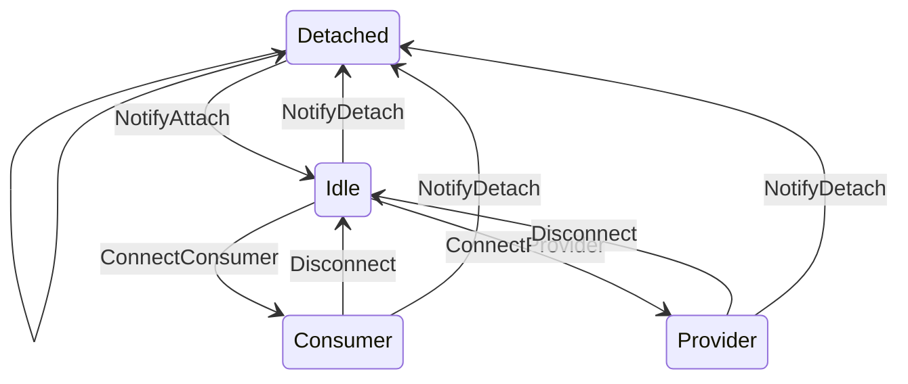
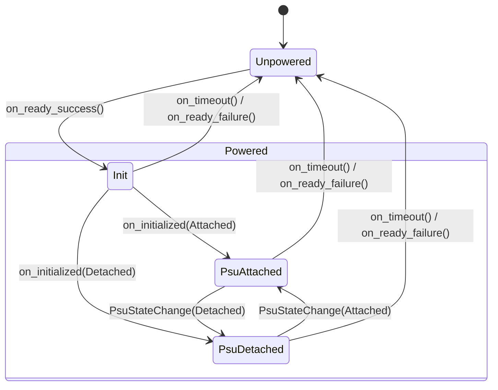

# Power Policy Service

This document provides a high-level overview of the power policy service. Implementations of this service 

## Design
This service is designed around a single policy implementation that manages any number of devices. The `policy::ContextToken` type can only be created once and is meant to allow the policy implementation access to the `policy::Context` type. The context maintains a list of devices. The `device::Device` struct maintains the state of a particular device and allows the policy implementation and a specific device to communicate. Transitioning a device between states is done through type-stated action structs located in the `action` module. `action::Device` contains types where the device state transition is driven from the device itself (e.g. the driver for an external charger detects an unplug event). While `action::Policy` contains types where the device state transition is driven from the policy (e.g. in response to that unplug event the policy directs another device to start consuming power).

## Internal Messaging

### Device State
Each device can be in one of the following states (`device::State`):

* `Detached`: Nothing attached, device cannot provide or consumer power
* `Idle`: The device is attached, but is not currently providing or consumer power
* `Consumer(max power)`: The device is currently consuming power
* `Provider(max power)`: The device is currently providing power

### Policy Messages
These messages are sent from a device to the power policy.

#### `NotifyDetach`
The device is no longer attached and cannot provide or consumer power.

#### `NotifyAttach`
The device is attached, but not providing or consuming power.

#### `NotifyConsumerCapability(max power)`
Informs the power policy of the device's maximum consumer power, the policy may decided to start consuming from this device. `None` indicates that the device is longer capable of acting as a consumer.

#### `RequestProviderCapability(max power)`
Requests the given power to provide.

#### `NotifyDisconnect`
Sent from a device in the `Provider` or `Consumer` states to notify that it is no longer providing or consuming. E.g. a PD source doing a role-swap to consumer.

### Device Messages
These messages are sent from the power policy to a device

#### `ConnectConsumer(max power)`
Directs the device to start consuming power at the specified power. If successfull the device will enter the `Consumer` state.

#### `ConnectProvider(max power)`
Directs the device to start providing power at the specified power. If successfull the device will enter the `Provider` state

#### `Disconnect`
Directs the device to stop providing or consuming and enter the `Idle` state.

### Comms Messages
These messages are used to communicate through the comms serivce.

#### `ConsumerDisconnected(device ID)`
The given device has stopped consuming.

#### `ConsumerConnected(device ID, max power)`
The given device has started consuming at the specified power.

## Charger State Machine

The power policy service manages charger hardware through a dedicated state machine. The charger tracks two pieces of state: an `InternalState` representing the charger's power and initialization status, and an optional cached `ConsumerPowerCapability` representing the current power policy configuration.

### Charger State

The charger can be in one of the following states (`charger::InternalState`):

* `Unpowered`: The charger hardware is not powered and cannot communicate.
* `Powered(Init)`: The charger is powered and uninitialized.
* `Powered(PsuAttached)`: The charger is powered, initialized, and a PSU is attached (ready to charge).
* `Powered(PsuDetached)`: The charger is powered, initialized, but no PSU is attached.

### Charger Events

Events originate from the charger hardware driver and are broadcast to the power policy service via `charger::event::EventData`:

#### `PsuStateChange(PsuState)`
Reports that the PSU attachment state has changed. Transitions between `Powered(PsuAttached)` and `Powered(PsuDetached)`. Invalid from `Unpowered` or `Powered(Init)`. Typically this is tied to a GPIO or some other signal that represents that the charger hardware has detected a PSU state change.

### Charger State Transition Methods

State transitions are driven by the driver (trait implementer) by calling methods on `charger::State` (accessed via `state_mut()`). The power policy service does not call these methods directly — it is the driver's responsibility to advance the state machine based on hardware observations:

#### `on_ready_success()`
Transitions an `Unpowered` charger to `Powered(Init)`. No-op if already powered. Should be called by the driver after confirming the charger hardware is powered and can communicate.

#### `on_ready_failure()`
Transitions a `Powered` charger to `Unpowered`. Capability is preserved for diagnostics. No-op if already unpowered. Should be called by the driver after `is_ready()` fails.

#### `on_initialized(PsuState)`
Transitions `Powered(Init)` to either `Powered(PsuAttached)` or `Powered(PsuDetached)` based on the PSU state. Returns an error if not in `Powered(Init)`. Should be called by the driver after hardware initialization completes, like at the end of the `init_charger()` trait method call.

#### `on_timeout()`
Unconditionally transitions to `Unpowered` and clears the cached capability. Should be called by the driver when a communication timeout with the charger hardware is detected.

#### `on_psu_state_change(PsuState)`
Transitions between `Powered(PsuAttached)` and `Powered(PsuDetached)`. Returns an error if not in a valid powered state. Typically this is called when a GPIO or some other signal that represents that the charger hardware has detected a PSU state change.

### Policy Integration

The charger state machine integrates with the PSU consumer selection flow:

* **Consumer connected**: When the policy selects a new power consumer, it calls `attach_handler(capability)` on each registered charger and caches the capability via `on_policy_attach()`. If a charger is `Unpowered` at this point, the policy calls `is_ready()` followed by `init_charger()` to bring it to an initialized state before attaching.
* **Consumer switched/disconnected**: When the policy disconnects a consumer (to switch or because no consumer is available), it calls `detach_handler()` on each powered charger and clears the cached capability via `on_policy_detach()`.

### Charger Trait

Device drivers implement the `charger::Charger` trait (which extends `embedded_batteries_async::charger::Charger`) to integrate with the power policy. The driver is responsible for driving the charger state machine — it must call the appropriate `State` transition methods (via `state_mut()`) based on hardware observations:

* `init_charger()` — Initializes charger hardware. Returns the current `PsuState`. The driver should call `state_mut().on_initialized(psu_state)` after successful initialization.
* `attach_handler(capability)` — Called when the power policy attaches to a new, best consumer. Should program the hardware for the requested capability.
* `detach_handler()` — Called when the power policy detaches the current PSU consumer, either to switch consumers or because the PSU was disconnected.
* `is_ready()` — Verifies the charger is powered and can communicate. Has a default implementation that returns `Ok(())`. The driver should call `state_mut().on_ready_success()` or `state_mut().on_ready_failure()` to advance the state machine accordingly.
* `state()` / `state_mut()` — Access the charger's `State`. Used by the driver to call state transition methods. The `State` struct fields are private to the `power-policy-interface` crate; transitions must go through the provided methods (e.g. `on_ready_success()`, `on_initialized()`, `on_timeout()`).